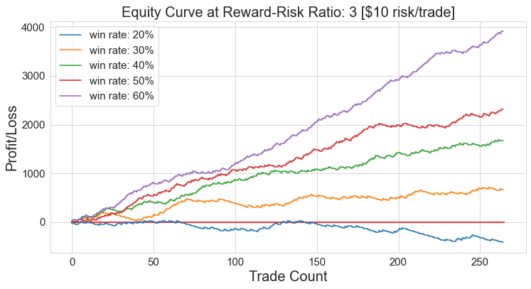
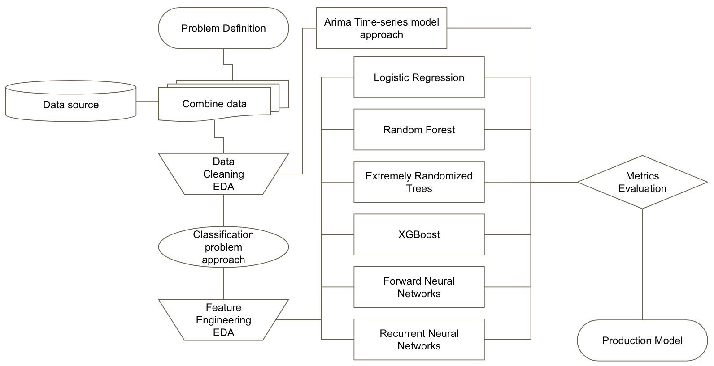

# Problem Statement
According to the 2019 Triennial Central Bank Survey of FX and OTC derivatives markets, the **foreign exchange or forex market** is the largest financial market in the world with a daily volume of **$6.6 trillion**. This is larger than the entire world's stock markets put together (approximately $84 billion for equities worldwide).

Within this huge amount of **intraday transactions**, approximately 70% are made by **institutional** investors while the remaning 30% made by private **retail** traders.

In this project, we will attempt to create a **predictive model** for **Intraday Retail Traders**. The model will use **historical Price and technical indicators data** to predict **probability of price increase or decrease within the next defined time period (24hrs, 7 days etc)**. 

The model must first **generalize well** for both seen and unseen future time-series data. Once that is achieved, model should conceptually allow user to **break-even or be profitable**.

# Disclaimer
- Foreign Exchange (FOREX) is a form of leveraged trading with significant levels of risk.
- One may suffer the complete loss of all initial investments.
- One should only trade what one is ready to lose.
- Past results will not guarantee future gains/losses
- The developer will not be responsible for any losses incurred by any users
- Any trading advice given during the course of development is just for illustrations only.

# Forex Basics: Reward-Risk Ratio
It is impossible to profit at every trade. Traders objective is to accumulate more wins than losses (net positive) over any time period.<br>
<br>
One of the most popular method is to set TP and SL with ratio > 1. Of course the **caveat is that when SL is closer to the entry price, the probabilty of price reaching the the SL level is higher than reaching the TP level**.
<br>


# Target Users
### Why Retail investors?
- Forex is no stranger to automated algorithmic trading softwares. Institutional investor with massive financial and compuational resources has been using predictive quant algorithms for many years.
- Online brokers/trading platforms has become very accessible to the general public. Present day restail investors are increasingly savvy and demand for **automated trading machines** is growing.

### Why Intraday?
- The success of a **Short term trade** (typical holding time from few minutes up to a week) is less influenced by macro economic factors. It is largely speculative.
- Intraday traders relied heavily on technical indicators which are mathematical transformationa of historical price data. (quantitative in nature)
- There are 3 broad indicators categories (few examples below)
    - Trend: Simple Moving Average (SMA), Exponetial Moving Average (EMA)
    - Momentum: Relative Strength index (RSI), Moving Average Convergence/Divergence (MACD), Stochastics Oscillator
    - Volatility: Average True Range (ATR), Bollinger Bands (BB)

# Methodology


# Directory Structure
```
capstone
|__ codes
|   |__ 1.0_Forex_Basics.ipynb: Basic information, Risk-Reward ratio & win rates
|   |__ 2.0_Data_Cleaning_EDA.ipynb: Data import, cleaning, EDA, re-sampling
|   |__ 3.0_ARIMA_Modelling.ipynb: ARIMA time-series model for DI & H1 timeframe
|   |__ 4.0_Target_define_D1.ipynb: Multi-Class Definition for DI timeframe
|   |__ 4.1_Target_define_D1.ipynb: Multi-Class Definition for HI timeframe
|__ datasets
|   |__ vegan.csv
|__ images
|   |__ equity_curve_rrr3.png
|   |__ eurusd_pip.jpg
|   |__ metatrader4_stop_loss_take_profit__1.jpg
|   |__ methodology.png
|   |__ OHLC.png
|   |__ Positive-RRR.jpg
|   |__ RRR_winrate.png
|__ Presentation.pdf
|__ README.md
```
# Data
- TBD

### Data Dictionary
|Feature|Type|Dataset|Description|
|---|---|---|---|

# Models Metric Summary
- D1 Timeframe
|Models|ARIMA|Log Regression|Random Forest|
|---|---|---|---|
|Modelling Time|43s|---|---|
|Long Trade Precision|NA|---|---|
|Short Trade Precision|NA|---|---|
|Overall Precision|NA|---|---|


# External Research
- TBD

### Type 1, 2 error implications
- TBD

# Conclusion & Recommendation
- TBD